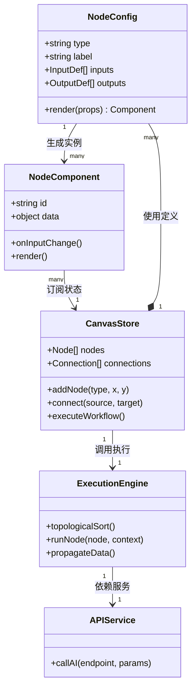
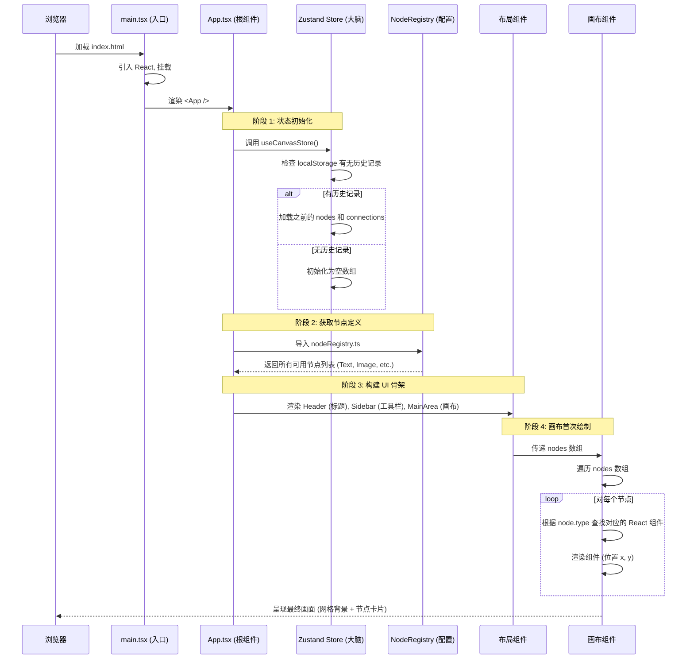

# AI 节点式工作流引擎 - 全栈软件设计文档 (面向初学者)

## 1. 项目全景概览

### 1.1 项目是什么？
这是一个**可视化编程平台**。想象一下像搭积木一样，把"加载图片"、"生成提示词"、"调用 AI 绘画"、"保存图片"这些功能块（节点）拖到画布上，用线连起来，就能自动执行一个复杂的 AI 任务。

**核心价值**：让不懂代码的人也能通过图形界面组合出强大的 AI 工作流。

### 1.2 技术栈图解
```mermaid
graph TD
    subgraph 前端 (Frontend)
        React[React 18 - UI 框架]
        TS[TypeScript - 类型安全]
        Zustand[Zustand - 轻量级状态管理]
        Tailwind[Tailwind CSS - 样式库]
        Vite[Vite - 构建工具]
    end

    subgraph 后端 (Backend)
        Node[Node.js - 运行环境]
        Express[Express - Web 服务器]
        Proxy[API 代理 - 隐藏密钥/解决跨域]
    end

    subgraph 外部服务 (External)
        StableDiffusion[Stable Diffusion API]
        LLM[大语言模型 API]
    end

    前端 -->|HTTP 请求 | 后端
    后端 -->|转发请求 | 外部服务
```

### 1.3 目录结构详解 (新手导航)

| 文件夹/文件 | 作用 | 新手必读指数 |
| :--- | :--- | :--- |
| `src/types/` | **字典**：定义所有数据的形状（如：什么是节点？什么是连线？） | ⭐⭐⭐⭐⭐ |
| `src/config/` | **说明书**：注册有哪些可用的节点，它们的输入输出是什么 | ⭐⭐⭐⭐⭐ |
| `src/stores/` | **大脑**：全局数据中心，所有组件都从这里读/写数据 | ⭐⭐⭐⭐⭐ |
| `src/components/canvas/` | **舞台**：画布核心，处理拖拽、连线、渲染节点 | ⭐⭐⭐⭐ |
| `src/components/nodes/` | **演员**：具体的节点 UI（如：文本框节点、图片预览节点） | ⭐⭐⭐⭐ |
| `src/utils/` | **工具箱**：纯函数工具（如：拓扑排序算法、坐标计算） | ⭐⭐⭐ |
| `backend/src/` | **网关**：负责转发请求，保护 API Key | ⭐⭐⭐ |

---

## 2. 核心架构设计

### 2.1 整体架构图 (MVC 变体)

本系统采用 **Component-Store-Service** 架构模式：

```mermaid
graph TB
    User[用户操作] --> Components[UI 组件层]
    
    subgraph 视图层 (View)
        Components -->|读取数据 | Stores
        Components -->|触发行动 | Actions
    end

    subgraph 状态层 (Model/Store)
        Stores[(Zustand Stores)]
        Stores -->|更新数据 | Stores
    end

    subgraph 逻辑层 (Controller/Service)
        Actions[Actions/Hooks] -->|调用 | Services
        Services[API Services] -->|HTTP | Backend
    end

    subgraph 后端层 (Backend)
        Backend[Express Server] -->|转发 | ExternalAI[外部 AI 服务]
        ExternalAI -->|返回结果 | Backend
        Backend -->|返回 JSON| Services
    end

    Services -->|更新状态 | Stores
    Stores -->|触发重绘 | Components
```

**通俗解释**：
1.  **用户**在屏幕上点击按钮（Components）。
2.  **组件**告诉"大脑"（Stores）："我要添加一个节点"。
3.  **大脑**更新数据列表，并通知所有组件："数据变了，快重新画！"
4.  如果需要联网，**组件**或**Hook**会呼叫"秘书"（Services）去后端拿数据。
5.  数据回来后，再次更新"大脑"，屏幕随之更新。

### 2.2 类与模块关系图



---

## 3. 核心概念与语法介绍 (小白必读)

在深入代码前，必须理解以下概念，这是读懂代码的钥匙。

### 3.1 什么是"节点 (Node)"？
在代码中，一个节点是一个 JSON 对象。
**语法示例 (`src/types/canvas.ts`)**：
```typescript
interface Node {
  id: string;          // 唯一身份证，如 "node_123"
  type: string;        // 类型，决定长什么样，如 "TextLoader", "ImageGen"
  position: {x, y};    // 在画布上的坐标
  data: {              // 核心数据
    label: string;     // 显示的名称
    inputs: { ... };   // 输入端口接收到的数据
    outputs: { ... };  // 输出端口要发出的数据
    config: { ... };   // 用户配置的参数（如提示词、步数）
  }
}
```

### 3.2 什么是"连线 (Connection)"？
连线定义了数据流向。A 的输出 -> B 的输入。
**语法示例**：
```typescript
interface Connection {
  id: string;
  sourceNodeId: string; // 起点节点 ID
  sourcePortId: string; // 起点端口名 (如 "image_output")
  targetNodeId: string; // 终点节点 ID
  targetPortId: string; // 终点端口名 (如 "image_input")
}
```

### 3.3 什么是"注册表 (Registry)"？
系统不知道有哪些节点，全靠注册表配置。这是**二次开发最常改的地方**。
**位置**：`src/config/nodeRegistry.ts`
**作用**：告诉系统，"有一种节点叫 `PromptNode`，它有一个文本输入口，一个字符串输出口，它的 UI 组件是 `PromptEditor`"。

---

## 4. 节点库详解 (功能说明书)

以下是系统预置的核心节点类型及其功能逻辑。若要新增功能，请参考此章节扩展。

### 4.1 输入类节点 (Input Nodes)
这类节点没有输入端口，只有输出端口，是工作流的起点。

| 节点名称 | 类型 ID (`type`) | 功能描述 | 输出数据 | 配置项 |
| :--- | :--- | :--- | :--- | :--- |
| **文本提示词** | `text_prompt` | 让用户输入一段文字描述（如"一只猫"）。 | `string` (文本内容) | 默认值、占位符 |
| **图片上传** | `image_loader` | 允许用户上传本地图片。 | `Blob/File` (图片二进制) | 最大尺寸限制 |
| **数字滑块** | `number_slider` | 提供一个滑动条，用于调整参数（如步数、强度）。 | `number` (数值) | 最小值、最大值、步长 |

### 4.2 处理类节点 (Process Nodes)
这类节点既有输入也有输出，对数据进行转换或调用 AI。

| 节点名称 | 类型 ID (`type`) | 功能描述 | 输入数据 | 输出数据 | 核心逻辑 |
| :--- | :--- | :--- | :--- | :--- | :--- |
| **提示词优化** | `prompt_enhancer` | 调用 LLM 将简单的词扩写成详细的提示词。 | `string` (原始提示) | `string` (优化后提示) | 调用 `/api/generate` 发送 LLM 请求 |
| **图像生成** | `image_generator` | 核心节点。调用 Stable Diffusion 生成图片。 | `string` (提示词), `number` (步数) | `ImageURL` (图片地址) | 构造 SD API 参数，POST 请求，解析返回的 Base64 |
| **图像缩放** | `image_resizer` | 前端 Canvas 处理，改变图片尺寸。 | `Image`, `number` (宽), `number` (高) | `Image` (新图片) | 使用 HTML5 Canvas API 重绘 |
| **逻辑判断** | `logic_switch` | 根据条件决定走哪条路（未来扩展）。 | `any`, `boolean` (条件) | `any` (输出) | 如果条件为真，输出 A，否则输出 B |

### 4.3 输出类节点 (Output Nodes)
这类节点只有输入，没有输出，是工作流的终点，用于展示或保存。

| 节点名称 | 类型 ID (`type`) | 功能描述 | 输入数据 | 表现行为 |
| :--- | :--- | :--- | :--- | :--- |
| **图片预览** | `image_preview` | 在节点卡片内直接显示生成的图片。 | `ImageURL` | 渲染 `` 标签，支持下载按钮 |
| **日志输出** | `log_console` | 打印接收到的数据到下方控制台面板。 | `any` | 将数据 `JSON.stringify` 后追加到日志列表 |
| **保存到相册** | `save_gallery` | 将图片存入浏览器的临时画廊。 | `ImageURL` | 触发浏览器下载或存入 IndexedDB |

---

## 5. 核心业务流程深度解析

### 5.1 场景一：从零开始渲染一个网页 (初始化流程)

**目标**：当用户打开网址，屏幕如何从空白变成可操作的界面？

**详细步骤序列图**：


**关键点解析**：
*   **响应式驱动**：`Store` 中的数据一旦变化，`Canvas` 组件会自动收到通知并重新运行 `render` 函数，无需手动操作 DOM。
*   **动态组件映射**：代码中有一个映射表（通常在 `nodeRegistry` 中），类似 `{'text_prompt': TextNode, 'image_gen': ImageNode}`。画布根据 `node.type` 字符串动态决定渲染哪个组件。

### 5.2 场景二：拖拽创建一个新节点 (交互流程)

**目标**：用户从左侧菜单拖入一个"图片生成"节点到画布。

**组件互动详解**：
1.  **发起方 (MaterialPanel)**:
    *   用户按下鼠标：触发 `onDragStart`。
    *   **动作**：调用 `useDragMaterialStore`，设置 `draggingType = 'image_generator'`。
    *   **HTML5 API**：设置 `dataTransfer` 数据。

2.  **接收方 (Canvas)**:
    *   用户拖动经过画布：触发 `onDragOver` (必须 `e.preventDefault()` 才能允许 Drop)。
    *   **视觉反馈**：计算鼠标在画布坐标系的位置，显示一个"幽灵节点"（半透明阴影），提示用户放下后的位置。

3.  **完成方 (Drop Handler)**:
    *   用户松开鼠标：触发 `onDrop`。
    *   **坐标转换**：`屏幕坐标` - `画布偏移量` = `节点实际坐标 (x, y)`。
    *   **调用 Store**：`canvasStore.addNode({ type: 'image_generator', x, y })`。

4.  **状态更新 (Store Action)**:
    *   生成唯一 ID：`const id = crypto.randomUUID()`。
    *   构造数据：从 `nodeRegistry` 复制默认的 `inputs` 和 `outputs` 结构。
    *   写入状态：`state.nodes.push(newNode)`。
    *   **触发重绘**：Zustand 通知所有订阅者，`Canvas` 重新渲染，新节点出现。

### 5.3 场景三：执行工作流 (核心业务逻辑)

这是系统最复杂的部分，涉及**拓扑排序**和**异步执行**。

#### 流程图
```mermaid
flowchart TD
    Start[用户点击运行] --> CheckKey{API Key 存在？}
    CheckKey -- 否 --> ShowSettings[跳转设置页]
    CheckKey -- 是 --> ValidateGraph{图结构合法？}
    
    ValidateGraph -- 有环路/断连 --> ShowError[报错：请检查连线]
    ValidateGraph -- 合法 --> TopoSort[拓扑排序]
    
    TopoSort --> Queue[生成执行队列: [A, B, C]]
    Queue --> ExecLoop{队列空了？}
    
    ExecLoop -- 是 --> Success[执行成功，更新预览]
    ExecLoop -- 否 --> PopNode[取出下一个节点 N]
    
    PopNode --> PrepareData[收集 N 的输入数据]
    PrepareData --> RunLogic[执行 N 的业务逻辑]
    
    RunLogic --> IsAsync{需要联网？}
    IsAsync -- 是 --> CallAPI[调用后端 /api/generate]
    CallAPI --> Wait[等待响应]
    Wait --> ParseRes[解析结果]
    IsAsync -- 否 --> CalcLocal[本地计算 (如数学运算)]
    CalcLocal --> ParseRes
    
    ParseRes --> UpdateStore[更新节点 N 的 outputs 和 logs]
    UpdateStore --> ExecLoop
```

#### 详细代码逻辑推演 (伪代码)

**1. 拓扑排序 (`src/utils/topologicalSort.ts`)**
*   **目的**：确定执行顺序。如果 A 的输出给 B，必须先执行 A。
*   **算法**：Kahn 算法或 DFS。
*   **输入**：所有节点和连线。
*   **输出**：有序数组 `['LoadImage', 'PromptEnhance', 'Generate']`。
*   **异常**：如果发现环路（A->B->A），抛出错误，阻止运行。

**2. 执行引擎 (`src/stores/runBus.ts` 或 `useRunTrigger.ts`)**
```javascript
async function runWorkflow() {
  // 1. 获取排序后的队列
  const queue = topologicalSort(nodes, connections);
  
  // 2. 准备上下文，存储每个节点的输出结果
  let runtimeContext = {}; 

  // 3. 逐个执行
  for (const nodeId of queue) {
    const node = nodes.find(n => n.id === nodeId);
    
    // 3.1 收集输入：从 runtimeContext 中找上游节点的输出
    const inputData = {};
    node.inputs.forEach(input => {
       // 找到连接这条线的源节点
       const sourceNode = findSourceNode(connections, input.port);
       inputData[input.name] = runtimeContext[sourceNode.id];
    });

    // 3.2 执行具体逻辑 (分发给不同处理器)
    try {
       const result = await executeNodeLogic(node.type, inputData, node.config);
       
       // 3.3 保存结果到上下文，供下游使用
       runtimeContext[nodeId] = result;
       
       // 3.4 更新 UI (显示"执行成功"，刷新图片预览)
       updateNodeStatus(nodeId, 'success', result);
    } catch (error) {
       // 3.5 出错处理：停止执行，标记红色，显示错误日志
       updateNodeStatus(nodeId, 'error', error.message);
       break; 
    }
  }
}
```

**3. 节点逻辑分发器 (`backend/src/services/executor.js` 或前端对应 Service)**
*   使用 `switch(node.type)` 判断：
    *   `case 'image_generator'`: 调用 Stable Diffusion API。
    *   `case 'text_prompt'`: 直接返回用户输入的文本。
    *   `case 'image_resizer'`: 使用 Canvas API 处理图片。

---

## 6. 二次开发指南 (How-To)

假设你是一个初级程序员，接到以下任务，该如何操作？

### 任务 A：添加一个新的"噪声生成器"节点
**需求**：这个节点不需要输入，输出一张随机的噪点图片。

**步骤 1：定义类型 (`src/types/canvas.ts`)**
*   通常不需要修改，除非数据结构大变。确保 `outputs` 能容纳 image 类型。

**步骤 2：注册节点元数据 (`src/config/nodeRegistry.ts`)**
```typescript
// 新增配置项
{
  type: 'noise_generator',
  label: '随机噪声',
  category: 'Input',
  inputs: [], // 无输入
  outputs: [{ id: 'noise_img', type: 'image', label: '噪声图' }],
  config: [   // 用户可配置的参数
    { key: 'size', type: 'select', options: ['512x512', '1024x1024'] }
  ],
  component: NoiseGeneratorNode // 指向下面的组件
}
```

**步骤 3：创建 UI 组件 (`src/components/nodes/NoiseGeneratorNode.tsx`)**
```tsx
export default function NoiseGeneratorNode({ id, data }) {
  return (
    <div className="node-card">
      <h3>{data.label}</h3>
      {/* 显示输出端口 */}
      <Port id="noise_img" type="output" />
      {/* 这里可以放一个按钮手动刷新噪声 */}
    </div>
  );
}
```

**步骤 4：实现执行逻辑 (`src/services/executionLogic.ts`)**
```typescript
case 'noise_generator':
  // 本地生成噪声的逻辑
  const canvas = document.createElement('canvas');
  // ... 填充随机像素 ...
  return canvas.toDataURL(); // 返回 base64 图片
```

### 任务 B：修改现有节点的样式
**需求**：让所有节点的圆角更大，背景色变深。

**步骤**：
1.  找到通用节点容器组件：通常是 `src/components/canvas/NodeWrapper.tsx` 或在 `src/styles/` 下的全局 CSS。
2.  修改 Tailwind 类名：将 `rounded-md` 改为 `rounded-xl`。
3.  如果是深色模式，检查 `src/stores/theme.ts` 中的颜色变量。

---

## 7. 常见问题排查 (Troubleshooting)

| 现象 | 可能原因 | 解决方案 |
| :--- | :--- | :--- |
| **拖拽节点没反应** | 1. `onDragOver` 没阻止默认行为<br>2. Store 未正确订阅 | 检查 `e.preventDefault()`；确认组件使用了 `useStore(selector)` |
| **连线连不上** | 1. 端口类型不匹配 (如 string 连 image)<br>2. 已达最大连接数 | 查看控制台报错；检查 `nodeRegistry` 中的 `type` 定义是否一致 |
| **点击运行没反应** | 1. API Key 为空<br>2. 图中有环路<br>3. 后端服务未启动 | 检查 Settings 页面；观察 Console 中的拓扑排序日志；确认 `npm run server` 已运行 |
| **图片不显示** | 1. CORS 跨域问题<br>2. Base64 格式错误 | 检查后端响应头 `Access-Control-Allow-Origin`；验证返回的数据前缀 `image/png...` |

---

## 8. 总结

本系统通过**数据驱动视图**的思想，将复杂的 AI 调用流程抽象为**节点**和**连线**。
*   **对于用户**：它是可视化的自动化流水线。
*   **对于开发者**：它是一个标准的 React 状态管理实践案例。

**核心口诀**：
> 想改界面找 Component，
> 想改数据找 Store，
> 想加新功能改 Registry，
> 想调接口看 Service。

希望这份文档能帮助你快速上手并进行二次开发！
